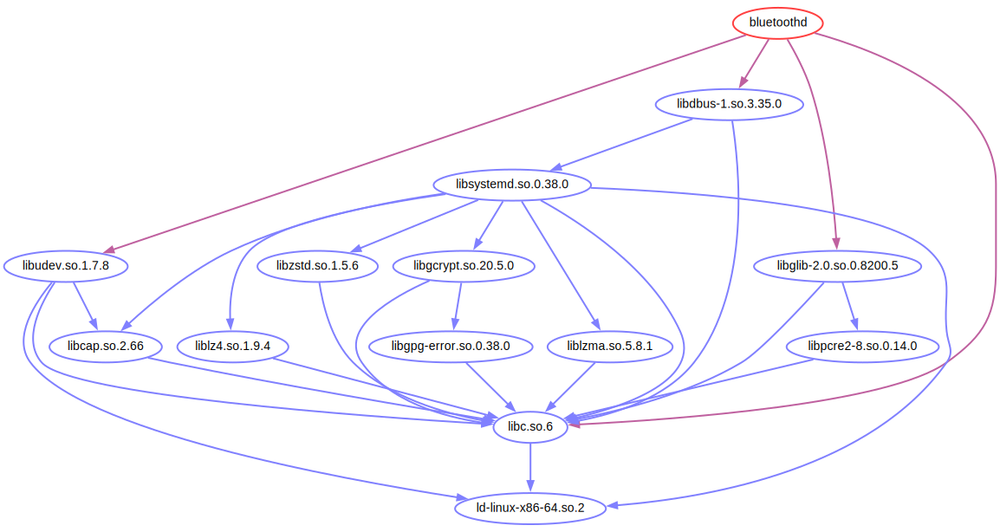

# FOSS Glossary

This glossary was created by a working group of lawyers and software
developers as part of an OSADL member project and is licensed under
CC0-1.0. In no case does it constitute individual legal advice.

Version: 1.0, July 2025

## Author attribution

[Copyright notice](#copyright-notice)

## Binary distribution package

A binary distribution package contains all the individual files required
by certain applications or libraries. Normally, the respective
applications or libraries after which the package is named are included
in the package; in individual cases, however, other special libraries,
configuration files as well as logos, images, audio/video files and
fonts may also be included. These files do not necessarily have any
copyright relationship with each other in the sense of a [derivative
work](#derivative-work). Additional applications or libraries that are
not only required by the special applications or libraries contained in
the package, but also by other applications or libraries and that can be
assumed in the respective system, are not included in the package.
Instead, the package contains a list of these packages, known as
[external package dependencies](#external-package-dependcency). One of the
most important functions of the installation program used to install a
binary distribution package on a computer is to check whether all
required external packages are installed and, if this is not the case,
to automatically download and install the missing packages from the
[Linux distribution server](#linux). Finally, a binary distribution
package also contains information on the licenses of the software
components it contains. As these have been provided voluntarily and more
or less carefully by the respective package maintainers, this
information does not necessarily have to be correct. Furthermore, this
information refers to the entirety of the included software and not to
each individual component. In any case, the existence of [copyleft
licenses](#copyleft) cannot be interpreted to mean that a [derivative
work](#derivative-work) of software components exists. Instead, this
requires the individual recording of the
[source code provenance](#source-code-provenance) of the individual
binary components.

## Build dependency

Build dependencies are programs and components that are required to
translate source code into binary programs or libraries, but which are
not themselves part of the resulting binary component. These include
tools such as a compiler. If the translation is performed by a [package
management system](#package-management-system), then this can also resolve
the necessary build dependencies. Build dependencies do not normally
form a [derivative work](#derivative-work) of the resulting binary
components.

## Callgraph

The term \"callgraph\" (can also be called \"dependency graph\") refers
to a program that can be used to visualize the recursive [link
dependencies](#link-dependency) between programs or libraries on one
side and libraries on the other. \"Recursive\" means that link
dependencies are completely resolved, i.e. dependencies on dependencies
are also taken into account. Instead of \"recursive\", the term
\"transitive\" can be used, which has the same meaning in this context.
The relationship graph that can be created by the \"Callgraph\" program
is also called a \"callgraph\". As link dependencies can only be made
visible in binary programs, a callgraph always refers to binary
components. In the callgraph of the server program *bluetoothd* in
Figure 1, the up to five-level dependency - first of the program on
libraries and then from the libraries to other libraries - can be seen.
Finally, practically all libraries require the C language
library (*libc.so.6*). Normally, all components connected recursively in
a [link dependency](#link-dependency) and thus leading to a [derivative
work](#derivative-work) are always recorded. In contrast to the
[package dependency](#package-dependency), the components displayed as
linked in a callgraph can be evaluated with regard to any [copyleft
licenses](#copyleft) they may contain. In addition to displaying the pure
callgraph, the Callgraph program also allows the analysis of the
function names used in a library and the output of the names of the
source code files used to produce a binary component. The latter is
called [source code provenance](#source-code-provenance) and is important
for the exact determination of the applicable licenses.

Figure 1: Example of a callgraph of the server
program \"bluetoothd\"

## Combined work

[Derivative work](#derivative-work)

## Copyleft

When creating a [derivative work](#derivative-work), there are
generally no restrictions on the choice of license terms for the
adaptation. However, it can happen that the license conditions of the
original work and the adaptation contradict each other and, as a result,
the derivative work can no longer be licensed in accordance with the
law. However, the license terms of the original work may contain a
clause according to which the derivative work may only be copied and
distributed if the original license is used for the adaptation. Such a
license clause is called a \"copyleft\", such a license is called a
\"copyleft license\" and software licensed in this way is called
\"copyleft software\".

## Copyright notice

The commonly used form of reference to the copyright holder and author
for software produced in a company is

Copyright © YEAR RIGHTHOLDER, author AUTHOR

The naming of the author is optional. In English, the first part should
correctly be referred to as \"copyright notice\" and the second part as
\"author attribution\". But the term \"copyright notice\" is usually
used for the notice in its entirety, although it is almost always a
matter of exclusively naming the rights holder. In German, the first
part is referred to as \"Rechteinhabervermerk\", the second part as
\"Urhebervermerk\". In contrast to English, the second part of the
notice is used for the notice in its entirety, rather than the fist
part, and it is called \"Urhebervermerk\" accordingly. In order to avoid
misunderstandings, and because the rights to software are usually
involved, it is recommended that the mixed word \"Copyright-Vermerk\" be
used in German. The German term \"Urhebervermerk\" is then restricted to
situations in which the rights granted by personality right are referred
to.

## Dependency

There are different types of dependencies between software components,
which are differentiated, for example, according to whether they are
relevant when delivering, building or running the software. These are
differentiated as follows and described in the respective places:

-   [Package dependency](#package-dependency)
-   [Build dependency](#build-dependency)
-   [Link dependency](#link-dependency)

## Derivation

[Derivative work](#derivative-work)

## Derivative work

If an existing work is modified or extended with permission, a
derivative work is created and a so-called adapter's copyright is
acquired. The original copyright is retained so that both the original
author and the adapter have a say in the licensing of the derivative
work. The editor\'s right to have a say can be restricted by a [copyleft
clause](#copyleft) in the original license of the work.

If certain functions that are indispensable for a software component are
contained in an external [library](#library) and not in the
respective software itself, the individual component is not
independently executable. The software only becomes executable through
dynamic or static [linking](#linking) with the other components. This
creates a derivative work in terms of copyright law. Connections other
than through such a function call, for example via a network interface,
via UNIX sockets, via pipes, via shared memory, through interpretation
or compilation, on the other hand, do not lead to a derivative work.
This distinction is particularly relevant in connection with
[copyleft](#copyleft). In special cases, individual consideration may be
necessary.

## Download server

[FOSS](#foss) of [Linux distributions](#linux-distribution) is usually
offered on download servers operated by the respective organizations
(for example \"Canonical\", \"Debian\" or \"Fedora\"). These download
servers of distributions have an important function in resolving
[external package dependencies](#external-package-dependency) when
additional dependent packages determined by the [package management
system](#package-management-system) are automatically downloaded and
installed during the installation of distribution packages. In order to
keep the load requirements on these download servers and therefore the
costs as low as possible, universities and large Internet providers
offer local so-called mirror servers whose content is closely
synchronized with the primary servers of the distributions. However,
download servers are not only available for complete [Linux
distributions](#linux-distribution), but also for individual software
components in source code or binary form, which are referred to as
[repositories](#repository). Repositories often not only contain
individual components, but also offer a version control system and a
development platform (e.g. GitHub). These repositories are regarded as
primary hosts for [FOSS](#foss) projects, and the names and version
numbers archived there are decisive for referencing a specific software
release in an SBOM, for example.

## Dynamic linking

[Linking](#linking)

## ELF header

The abbreviation ELF stands for \"Executable and Linkable Format\". For
applications, this header contains the names of the required libraries
(\"NEEDED\") and the names of the required functions (\"UND\", stands
for \"undefined\"). Libraries contain the names of the functions
provided (\"FUNC\") in the ELF header, which applications can connect to
at runtime and then use. The ELF header can also store information about
which source code file was used to create each binary software, which is
used to determine the [source code provenance](#source-code-provenance).
The programs *readelf* and *pyreadelf* can be used to read and
display the entire ELF data structure of a program or library. The ELF
headers are also used by the [Callgraph](#callgraph) program to create a
relationship graph of the software components connected to each other in
a [link dependency](#link-dependency) and to create the prerequisites
for the aforementioned source code provenance.

## External package dependency

[Package dependency](#package-dependency)

## FOSS

The abbreviation FOSS stands for \"Free and Open Source Software\" and
is used for software whose license meets the requirements defined for
it. Essentially, such a license must permit the unrestricted use,
modification and analysis of the software as well as its distribution
under free and non-discriminatory conditions. The two terms \"Free
software\" and \"Open Source software\", which are also sometimes used,
are legally identical, but originate from different ideologies. They are
combined as FOSS in order to acknowledge both ideologies without
emphasizing one in particular.

## Free software

[FOSS](#foss)

## Internal package dependency

[Package dependency](#package-dependency)

## Library

Many functions of a computer program are required by numerous other
software components in the same way. These are, for example, standard
functions, such as for memory management or accessing storage media.
However, they are often also complete subsystems with which, for
example, mathematical calculations can be carried out or graphical user
interfaces can be integrated into a software program. If each individual
program were to contain all the required functions itself, [Linux
distributions](#linux-distribution) could no longer be delivered on just
a few CDs or DVDs; instead, hundreds or even thousands of data carriers
would be required. For this reason, commonly required functions are
combined in so-called libraries. These can then be used jointly by
different programs. The connection is made via [linking](#linking),
which technically enables the components to work together.

## Link dependency

Link dependency refers to the fact that software components require
certain [libraries](#library) at runtime at the latest in order to be
able to run. In contrast to [package dependency](#package-dependency),
this results in a very specific type of connection, which is called
[linking](#linking) and basically creates a [derivative
work](#derivative-work), which must be taken into account for
[copyleft licenses](#copyleft).

## Linking

Linking means that two software components are connected to each other
in a special way so that program code from both components can be used
together. Such linking can take place at the final stage of software
production, so that the software components are combined into a single
file. This is known as static linking. However, it is also possible to
equip the concerned software components with a standardized software
interface so that they can be produced and delivered independently of
each other. Such linking only takes place at runtime of the respective
software and is known as dynamic linking. In terms of copyright law,
i.e. with regard to the creation of a [derivative work](#derivative-work),
there is no difference between static and dynamic linking. This is
because in each case there is a [link dependency](#link-dependency).
It must therefore be determined whether a [copyleft license](#copyleft)
is involved in at least one of the cases, so that the corresponding
special license obligations for the other software components must be
observed. In order to provide a mechanism for the dynamically linked
components to determine at runtime which other components are needed
and which functions are provided, they are equipped with a so-called
[ELF header](#elf-header) structure at the beginning of the
code. The various hierarchical link relationships between
applications and libraries can be displayed as dependency graph or in
text form using the [Callgraph](#callgraph) program. Other types of
connection or communication between software components are not referred
to as linking and do not normally generate a [derivative work](#derivative-work).

## Linux

If it is not obvious from the context, the stand-alone term \"Linux\"
should be avoided. This is because in individual cases it can refer to
very different things such as the [Linux kernel](#linux-kernel), the
[operating system](#operating-system) or a complete [Linux
distribution](#linux-distribution).

## Linux distribution

A Linux distribution (abbreviation: \"distro\") refers to the bundled
compilation of functionally coordinated software packages with which a
complete Linux system, such as a workstation or server, can be
installed. Essential components of a distribution are the [package
manager](#package-manager) for installing and managing software, a
[download server](#download-server) (including mirror servers), [binary
distribution packages](#binary-distribution-package) and [source code
distribution packages](#source-code-distribution-package), as well as an
update mechanism for rectifying security gaps and functional errors.
Last but not least, in many cases a public development server is also
provided (e.g. [https://koji.fedoraproject.org/koji/](https://koji.fedoraproject.org/koji/)
for \"Fedora\"), on which the development and testing of the software
packages takes place. The most commonly used distributions are based on
the \"Debian\" or \"Fedora\" distribution. Both provide software
packages in both binary and source code form. Since the usual
installation method for these distributions is based exclusively on
binary distribution packages, the availability of the source code
distribution packages is an essential element for fulfilling the
disclosure obligations of the copyleft licenses. These are made
available exclusively for download, usually via the package manager. It
should be noted that the distributions do not make all versions of
source code packages permanently available, so that subsequent
downloading of older versions can be difficult or even impossible. In
this context, the \"Gentoo\" distribution should be mentioned, which is
always a complete source code distribution.

## Linux kernel

The Linux kernel is a stand-alone piece of software that enables a
program to access the individual hardware of a computer. Each [Linux
distribution](#linux-distribution) contains a specific version of the
Linux kernel and provides suitable auxiliary programs for it.

## Open Source software

[FOSS](#foss)

## OSSelot project

The OSSelot project aims to curate the largest possible number of
frequently used [FOSS](#foss) based on the respective
[repository](#repository) and to make the resulting documents available
to the general public in common formats under a permissive [FOSS
license](#foss) so that unnecessary parallel work is avoided. As part of
the project, all curated software for which this is possible will be
compiled in a standard configuration and the [source code
provenance](#source-code-provenance) determined.

## Operating system

The operating system provides all the functions required to run programs
on a computer. In a Linux-based system, this usually includes the [Linux
kernel](#linux-kernel) and the driver modules, if these modules are
configured, as well as an initial program such as the shell with the
necessary [libraries](#library) to start other programs. This
corresponds to the traditional definition of an operating system.
Whether and, if so, which other components are to be described as
belonging to the operating system is left to the individual definition
in a specific context. Candidates for this are

-   General administration programs (for Linux *coreutils*
    and *util-linux*)
-   Background programs of all kinds, e.g. for graphics, time, login
-   Other language libraries, for example for C++

In this context, a distinction is made between \"kernel space\" and
\"user space\". The operating system kernel and the driver modules that
communicate with the computer hardware run in kernel space. The
application programs and the libraries they require run in user space.
Communication between kernel space and user space takes place via an
operating system-independent interface, the so-called syscall interface,
which represents a copyright separation. Calls of application programs
or libraries from the user space to the kernel space are referred to as
\"system calls\". The license of the Linux kernel contains an explicit
note that such system calls do not create a [derivative
work](#derivative-work) of the Linux kernel.

## Package dependency

The term package dependency, when used alone, is ambiguous. The term
\"internal package dependency\" refers to the components that are
contained in a binary distribution package. These can be programs and
libraries, for example, but also fonts, graphics and documentation.

In contrast, the term \"external package dependency\" is used for other
binary distribution packages which require the components of a package
for execution and which the [package manager](#package-manager) therefore
automatically installs during installation. Neither the internal nor the
external package dependency necessarily leads to a copyright connection
in the sense of a [derivative work](#derivative-work).

## Package management system

The package management system is the essential software component of a
[Linux distribution](#linux-distribution) and was specially developed
for this purpose. This software, which usually consists of a large
number of individual applications and libraries, is used to create and
manage [source code distribution
packages](#source-code-distribution-package) and [binary distribution
packages](#binary-distribution-package) and make them available on
[download servers](#download-server). Users can download [source code
distribution packages](#source-code-distribution-package) and produce them
locally using the same procedure as on the public development servers,
for example to fix program errors or to extend functionality. The two
most commonly used package formats are probably \"deb\" (e.g. for the
\"Debian\" and \"Ubuntu\" distributions) and \"rpm\" (e.g. for the
\"Fedora\" distribution). Other package formats for certain programming
languages include Java (Maven, Gradle), Python (Pip) and C++ (Conan).

## Package manager

The package manager is an important component of [package management
systems](#package-management-system) and ensures that all software installed
on a computer is consistent, i.e. that all components required to run
the installed programs are available. Therefore, software must never be
installed or removed directly on a system managed by a package manager,
as the list of installed software components managed internally by the
package manager would then no longer correspond to reality and any
further use of the package manager would inevitably be incorrect. While
interpreter languages such as Python or Javascript often execute source
code at runtime and can be managed directly, compiler languages such as
C++ first require the code to be translated into machine instructions;
this is also reflected in the structure and use of the respective
[package management systems](#package-management-system).

## Principle of exhaustion

In general, the principle of exhaustion concerns the conditions under
which a work may be redistributed after it has been placed on the market
for the first time. Copyright law grants the creator of a work two
important rights in particular: Firstly, copyright law prohibits all
other persons from copying the work unless they have obtained permission
from the creator, i.e. the creator has the exclusive right of
reproduction. Secondly, copyright grants the creator the right to decide
whether and, if so, to whom to distribute the work, i.e. the creator
also has the exclusive right of distribution. This changes after the
work has been sold for the first time. While the prohibition of copying
as a consequence of the exclusive right of reproduction continues to
apply after the sale and is unproblematic, it would mean a very
far-reaching restriction of the free movement of goods if the creator of
a work could control the distribution of an original or reproduction of
this work even after its sale. Therefore, after the first sale, the
creator\'s right to control the distribution of the original or a copy
of the work expires. The same applies to patent and trademark rights.
This expiry of rights is referred to as exhaustion, and for software in
particular, the exhaustion of the exclusive distribution right in the
event of sale within the EU and the EEA is regulated, for example in
Germany, in Section 69c no. 3 sentence 2 UrhG (German copyright law).
Important prerequisites for a resale under the
principle of exhaustion are that the original sale of the software is
made by the creator or with the creator\'s consent, in compliance with
any license requirements, that the software has not been modified after
the initial sale and that the software is not retained on a separate
data carrier. If these conditions apply, the software may therefore be
passed on without further permission from the creator. This also applies
to software that was already installed in a device when it was first
purchased and is then resold unchanged and not installed elsewhere, such
as the car entertainment system in a used car or the operating system of
a resold used internet router. In both cases, it is not the seller of
the used goods who must fulfill the license obligations, but the party
who originally placed the software on the market after the last
modification, i.e. in the example the car manufacturer or the router
manufacturer.

## Related work

[Derivative work](#derivative-work)

## Repository

[FOSS](#foss) is usually made available by the developers on Internet
servers in a so-called repository. The individual files and the progress
of their production can be viewed and tracked there. In addition, stable
and particularly well-tested versions are designated as releases at
certain intervals and given a version tag. This version tag is then used
to identify a specific development status and is generally also adopted
by [Linux distributions](#linux-distribution). The source code files in
the repository or the release tag used in the repository represent the
only generally binding reference for a software version. A single
release of a repository can result in countless [source code
distribution packages](#source-code-distribution-package) of the various
distributions and from these in turn a multiple of [binary distribution
packages.](#binary-distribution-package) The [OSSelot
project](#osselot-project) therefore refers exclusively to the
respective repository of a software and to the release tags used there.

## Source code distribution package

The basis for producing a [binary distribution
package](#binary-distribution-package) is the [source code distribution
package](#source-code-distribution-package), which contains the unique URL
for obtaining the original source code from the respective
[repository](#repository), any necessary patches and instructions for
configuration and compilation. There is usually a special [package
manager](#package-manager) program that can be used to create the source
code distribution package from the specifications of a package. Binary
distribution packages can then be created either in the same step or in
a further step. Several binary distribution packages are usually created
from a single source code distribution package. While the source code
distribution package is usually independent of a particular computer
architecture, the binary distribution package can only be used on the
particular computers for which it was produced.

## Source code provenance

Since not every file contained in a [repository](#repository) or in a
[source code distribution package](#source-code-distribution-package) is used
to build a specific binary file, the license information provided there
cannot be used to infer the licensing of software produced from this
source code. This also applies to license information in a
complete [binary distribution package](#binary-distribution-package),
which usually contains several binary software components, because it is
not noted to which component the respective license information applies.
The only way to obtain correct information on the licensing of binary
software is to log the source code files used during production and
include them in the [ELF header](#elf-header) of the binary software.
This is called source code provenance and is supported by the
[Callgraph](#callgraph) program.

## Static linking

[Linking](#linking)
